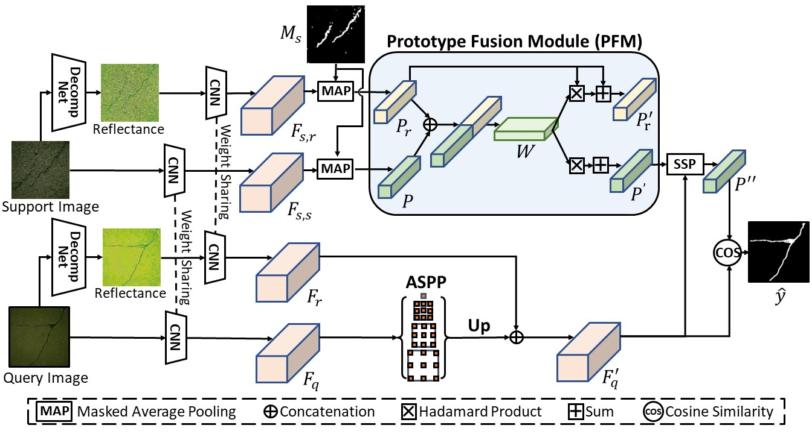
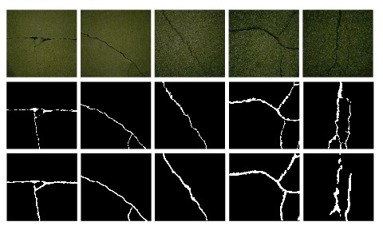
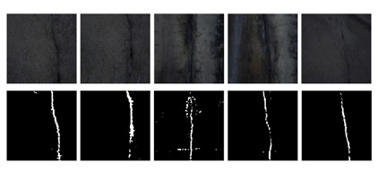

# [ICRA2024] CrackNex: a Few-shot Low-light Crack Segmentation Model Based on Retinex Theory for UAV Inspections
## Abstract
Routine visual inspections of concrete structures are imperative for upholding the safety and integrity of critical infrastructure. Such visual inspections sometimes happen under low-light conditions, e.g., checking for bridge health. Crack segmentation under such conditions is challenging due to the poor contrast between cracks and their surroundings. However, most deep learning methods are designed for well-illuminated crack images and hence their performance drops dramatically in low-light scenes. In addition, conventional approaches require many annotated low-light crack images which is time-consuming. In this paper, we address these challenges by proposing CrackNex, a framework that utilizes reflectance information based on Retinex Theory to learn a unified illumination-invariant representation. Furthermore,  we utilize few-shot segmentation to solve the inefficient training data problem. In CrackNex, both a support prototype and a reflectance prototype are extracted from the support set. Then, a prototype fusion module is designed to integrate the features from both prototypes. CrackNex outperforms the SOTA methods on multiple datasets. Additionally, we present the first benchmark dataset, LCSD, for low-light crack segmentation. LCSD consists of 102 well-illuminated crack images and 41 low-light crack images.

<p align="middle">
    
</p>

Authors: [Zhen Yao](https://scholar.google.com/citations?hl=zh-CN&user=qd8Blw0AAAAJ), [Jiawei Xu](https://scholar.google.com/citations?user=b3XkcPkAAAAJ&hl=en&oi=ao), [Shuhang Hou](https://henghuiding.github.io/), [Mooi Choo Chuah](https://scholar.google.com/citations?hl=en&user=SZBKvksAAAAJ).

## LCSD Dataset
We have established a crack segmentation dataset, LCSD. It comprises 102 normal light crack images and 41 low-light crack images with fine-grained annotations.

You can download the datasets from [the link](https://drive.google.com/drive/folders/1K81AjvIFje5BBxG1qxFmfqRhxf0PKNxe?usp=drive_link).

## Requirements

- Python 3.7
- PyTorch 1.9.1
- cuda 11.1
- opencv
- sklearn

Conda environment settings:
```bash
conda create -n cracknex python=3.7 -y
conda activate cracknex

pip install torch==1.9.1+cu111 torchvision==0.10.1+cu111 -f https://download.pytorch.org/whl/torch_stable.html
conda install -c conda-forge cudatoolkit-dev==11.1.1
pip install opencv-python==4.5.2.54
pip install scikit-learn
pip install tqdm
```

## Data preparation
**Pretrained model:** [ResNet-50](https://drive.google.com/file/d/1zphUj3ffl8J2HCRq5AjPsdOVojiGuQZB/view?usp=drive_link) | [ResNet-101](https://drive.google.com/file/d/1G6MVe_8ywk3NyHwpWWoUoZtvQ4pWJWj-/view?usp=drive_link)


### File Organization

To prepare the LCSD datasets, you need to download all images and labels from above link. Put all images in ``JPEGImages/`` subfolder and all labels in ``SegmentationClassAug/`` subfolder, and two split ``txt`` file into ``ImageSets/`` subfolder.
```
    ../                         # parent directory
    ├── ./CrackNex              # current (project) directory
    |   ├── codes               # various codes
    |   └── ./pretrained        # pretrained model directory
    |            ├── resnet50.pth
    |            └── resnet101.pth
    └── Datasets_CrackNex/
        ├── LCSD/            
        │   ├── ImageSets/
        │   ├── JPEGImages/
        │   └── SegmentationClassAug/
```

## Run the code

You can adapt the scripts of `train.sh` and `test.sh` to train and evaluate your models.

You may change the ``backbone`` from ``resnet50`` to ``resnet101`` or change the ``shot`` from ``1`` to ``5`` for other settings.

```
bash train.sh
```

```
bash test.sh
```

Remember to change the path to dataset and checkpoint.

## Evaluation and Trained Models

### LCSD

| Method | Setting |   Backbone  | mIoU |
| :-----: | :-----: | :---------: | :----: |
| CrackNex (Ours) | 1-shot  |  ResNet-50  | [63.85](https://drive.google.com/file/d/1T9i1S_UlFOzjuSpn7Oeo9RX7BYgQ9jMw/view?usp=drive_link)  |
| CrackNex (Ours) | 1-shot  |  ResNet-101  | [66.10](https://drive.google.com/file/d/1vM3cRazeLmU2QnLIY4RjS7JTJBfHaCV3/view?usp=drive_link)  |
| CrackNex (Ours) | 5-shot  |  ResNet-50  | [65.17](https://drive.google.com/file/d/1uADCeaGZQNvr25dqVgXNJcjbZNAIrdI-/view?usp=drive_link)  |
| CrackNex (Ours) | 5-shot  |  ResNet-101  | [68.82](https://drive.google.com/file/d/1D3R9rCHrP58l48qSOhgtMzmDLvk8-8nf/view?usp=drive_link)  |

### Visualization in LCSD

<p align="middle">
    
</p>

### Visualization of videos in the wild
<p align="middle">
    
</p>

## Acknowledgment
This codebase is built based on [SSP's baseline code](https://github.com/fanq15/SSP/). We thank SSP and other FSS works for their great contributions.

## Citation
```bibtex
@article{yao2024cracknex,
  title={Cracknex: a few-shot low-light crack segmentation model based on retinex theory for uav inspections},
  author={Yao, Zhen and Xu, Jiawei and Hou, Shuhang and Chuah, Mooi Choo},
  journal={arXiv preprint arXiv:2403.03063},
  year={2024}
}
```